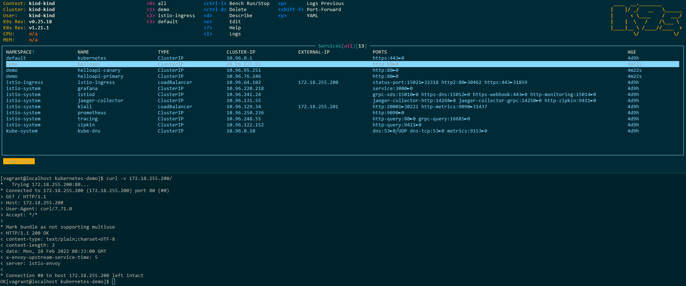

# Introduction

## Prerequisites

Before you start executing commands from below chapters, please make sure you have installed
 - [docker](https://docs.docker.com/get-docker/)
 - [kubectl](https://kubernetes.io/docs/tasks/tools/)
 - [helm](https://helm.sh/docs/intro/install/)
 - [kind](https://kind.sigs.k8s.io/docs/user/quick-start/)
 - [k9s](https://k9scli.io/topics/install/)

## Creating Kubernetes cluster and Container Registry

Below command will use [kind](https://kind.sigs.k8s.io/docs/user/quick-start/) to create local Kubernetes clusters and Container Registry
```
# brew install kind
./kind-create-cluster-and-registry.sh
```

## Deploying Istio with Ingress and addons
Once we have up an running kubernetes cluster and container registry we can install [Istio:](https://istio.io/)

```
kubectl create namespace istio-system
helm install istio-base istio/base -n istio-system
helm install istiod istio/istiod -n istio-system --wait
```
 
We will also install istio ingress:
```
kubectl create namespace istio-ingress
kubectl label namespace istio-ingress istio-injection=enabled
helm install istio-ingress istio/gateway -n istio-ingress --wait
```

Once istio and ingress are installed on our cluster we can deploy also addons:

```
kubectl apply -f https://raw.githubusercontent.com/istio/istio/release-1.13/samples/addons/prometheus.yaml
kubectl apply -f https://raw.githubusercontent.com/istio/istio/release-1.13/samples/addons/grafana.yaml
kubectl apply -f https://raw.githubusercontent.com/istio/istio/release-1.13/samples/addons/kiali.yaml
kubectl apply -f https://raw.githubusercontent.com/istio/istio/release-1.13/samples/addons/jaeger.yaml
```

## Deploying Flagger

Next we can install [Flagger](https://flagger.app/)

```
helm repo add flagger https://flagger.app
kubectl apply -f https://raw.githubusercontent.com/fluxcd/flagger/main/artifacts/flagger/crd.yaml
helm upgrade -i flagger flagger/flagger --namespace=istio-system --set crd.create=false --set meshProvider=istio --set metricsServer=http://prometheus:9090
```

## Building Rest application

Now we can build our rest application as a Docker image and push it to local registry
```
docker build -t localhost:5001/helloapi:v0.0.1 .
docker push localhost:5001/helloapi:v0.0.1
```

Application by default is running on `8080` port and returns `200` response on `/`


## Deploying rest application to cluster

```
kubectl create namespace demo
kubectl label namespace demo istio-incection=enabled
kubectl apply -f helloapi-deployment.yaml
kubectl apply -f helloapi-canary.yaml
kubectl apply -f helloapi-gateway.yaml
```

## Executing tests

In order to verify that our application is available through istio-ingress I deployed [Metallb](https://metallb.universe.tf/) on kind cluster by following [https://kind.sigs.k8s.io/docs/user/loadbalancer/](https://kind.sigs.k8s.io/docs/user/loadbalancer/) instructions

Below screenshot shows that everything is working as expected

